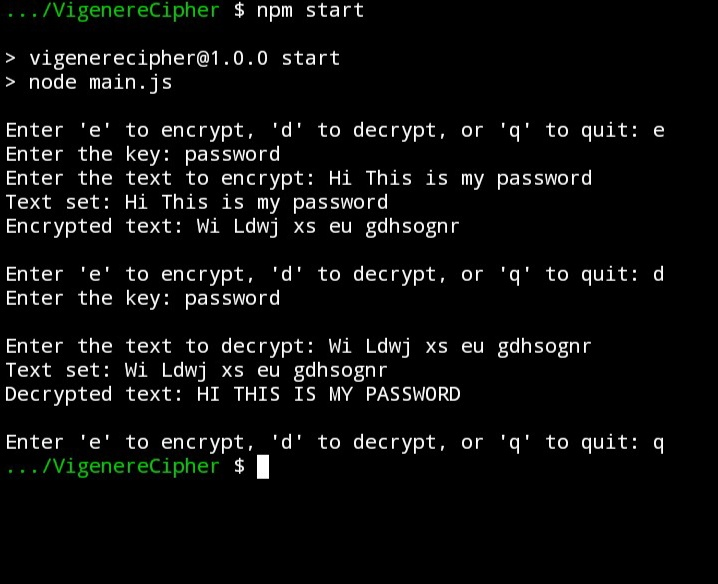
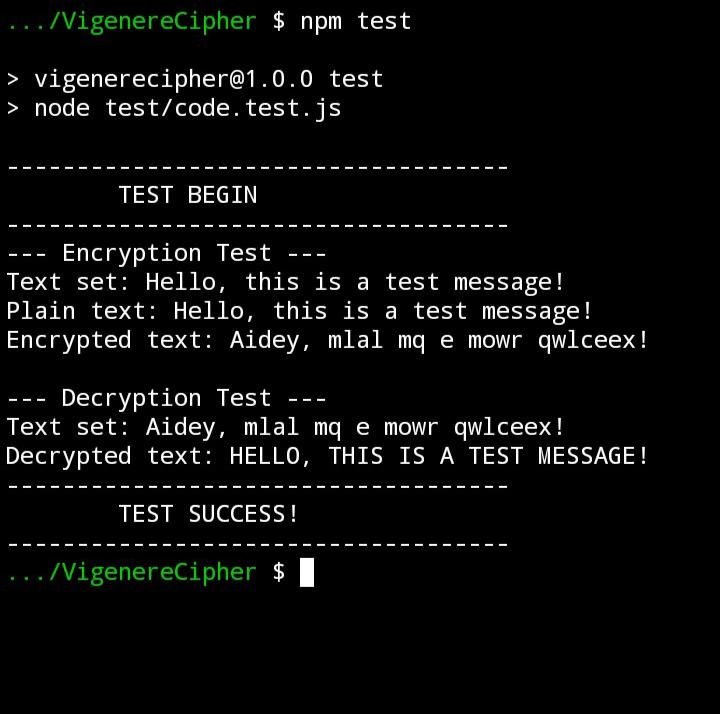

# 🔐VigenereCipher🔐
## 👉Description
This is a JavaScript implementation of the Vigenère Cipher, a method of encrypting alphabetic text by using a simple form of polyalphabetic substitution. 
The Vigenère Cipher is a form of symmetric encryption where the same key is used for both encryption and decryption.

## 👉Usage
Within this project you can start using it with `npm start` to starting preform encryption or decryption 
   - Import the `VigenereCipher` class into your JavaScript file.
   - Create an instance of the `VigenereCipher` class by providing a key.
   - Set the text to be encrypted or decrypted using the `setText(text)` method.
   - Use the `encrypt()` or `decrypt()` methods to perform encryption or decryption, respectively.

### 👉Example
```
// Basic Initialization 
  const VigenereCipher = require("./code");
  const cipher = new VigenereCipher("myKey");

// perform Encryption
  cipher.setText("Hello, this is a test message!");
  const encryptedText = cipher.encrypt();
      console.log(`Encrypted text: ${encryptedText}`);

// Perform decryption
  cipher.setText(encryptedText);
  const decryptedText = cipher.decrypt();
      console.log(`Decrypted text: ${decryptedText}`);
```

## 👉Test
You can run test perform encryption and decryption tests using the `VigenereCipher` class in file `code.js`.

To run the tests:
1. The main file test within file `test/code.test.js`
2. Run the command: `npm test`

## Screenshot Performance:
### 💪The main code CLI
[](screenshot/main.JPG)

## 💪The Test code
[](screenshot/test.JPG)
